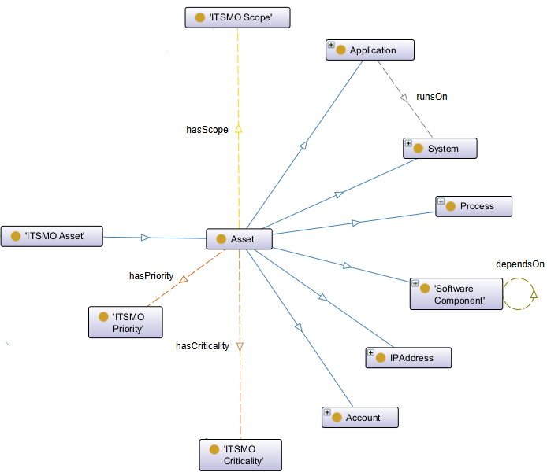
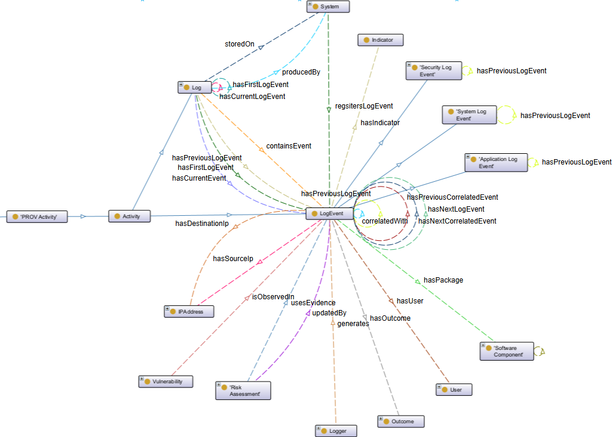
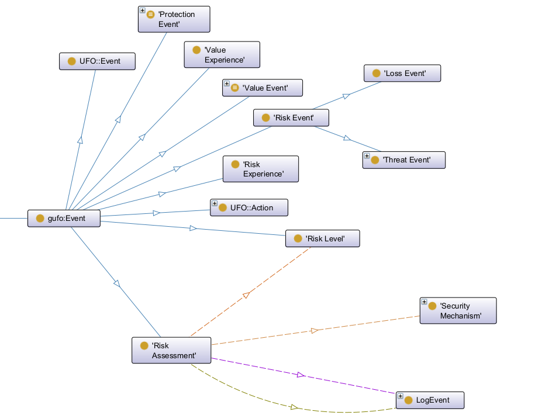
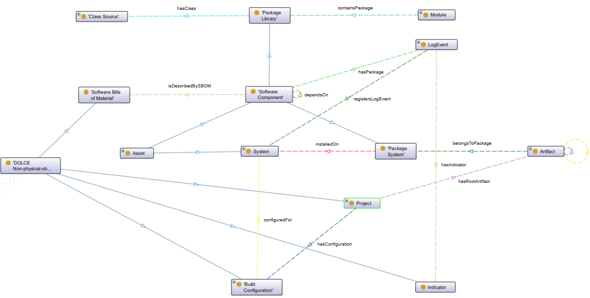

<p align="center">
  
</p>

# AMISecOnto
This repository contains all development for the project's ontology/knowledge model, a domain-specific ontology designed to support NIS2-compliant cybersecurity analysis in academic management information systems (AMIS) through standardized and semantically enriched knowledge representation. The ontology formally models the complete cybersecurity monitoring and incident-analysis workflow, integrating heterogeneous log evidence (system, application, and security logs), software supply-chain and asset information, vulnerability intelligence (CVE, CPE, CWE, and CVSS), and risk-aware analysis aligned with NIS2 Article 21 obligations. Built upon foundational upper ontologies, such as DOLCE, and reusing established provenance, actor-identity, IT-service-management, and risk-treatment ontologies (PROV-O, FOAF, ITSMO, and ROSE), AMISecOnto ensures interoperability, extensibility, and compliance with FAIR principles. This repository includes a total of 12 competency questions, the corresponding SPARQL queries, the ontology in OWL/Turtle format, knowledge graph construction scripts, and synthetic example datasets (FénixEdu logs and NVD vulnerability records), as well as supporting documentation demonstrating the interoperability of AMISecOnto with major cybersecurity and Semantic Web standards.

## Table of Contents

- [Overview](#overview)
- [Key Features](#key-features)
- [ Ontology Modules](#ontology-modules)
  - [Asset Module](#asset-module)

## Overview

**AMISecOnto** is a modular cybersecurity ontology that transforms heterogeneous data, such as AMIS system logs and vulnerability intelligence (e.g., NVD), into a unified semantic knowledge graph for advanced security analysis.

---

## Key Features

- **Integrated data ingestion**: Combines raw logs with vulnerability data for contextual enrichment  
- **Modular design**: Core modules for Entities, Vulnerabilities, and Standards  
- **Semantic enrichment**: Links events to CVE, CPE, and CVSS information  
- **Standards-based**: RDF, OWL  
- **Interoperability & provenance**: Ensures traceability and cross-system integration  
- **Analytics-ready**:
  - Event correlation  
  - Risk assessment  
  - Incident reconstruction  
  - Evidence tracing  

## Competency Question (CQ) – Driven SPARQL Queries
The ontology is designed to answer the following competency questions:

### Event Discovery and Filtering
- **CQ1**: Which events occurred within a specific time range and satisfy selected filters?
- **CQ2**: Which events belong to a specific application, service, host, or component?

### Event Lineage Tracing
- **CQ3**: Which sequence of log events led to a specific error event?
- **CQ4**: Which events occurred before and after a given incident?

### Authentication and Access Tracing
- **CQ5**: Which authentication attempts preceded access or privilege-escalation events?
- **CQ6**: Which information is required to reconstruct a user session timeline?

### Application, System, and Security Tracing
- **CQ7**: Which container lifecycle events are linked to application errors?
- **CQ8**: Which database events correlate with application requests?

### Vulnerability Analysis and Exposure
- **CQ9**: Which installed or observed software components are affected by known vulnerabilities (CVEs)?
- **CQ10**: Which vulnerabilities are associated with specific packages, versions, or system components?

### Risk Assessment and Incident Reconstruction (NIS2-aligned)
- **CQ11**: Which combinations of log events and vulnerabilities indicate high-risk situations or potential compromise?
- **CQ12**: How can risk exposure be derived from log evidence, vulnerability severity (e.g., CVSS), and observed behavior?

---

## SPARQL Queries
SPARQL queries in AMISSecOnto are designed to retrieve relevant cybersecurity information from the knowledge graph, supporting tasks such as event discovery, filtering, and analysis. This approach ensures that the ontology effectively addresses practical requirements, enabling the extraction of insights related to vulnerabilities, threats, assets, and security events in real-world scenarios.

## Event Discovery and Filtering
Consider for the following SPARQL queries the prefixes below.
```sparql
PREFIX : <http://www.semanticweb.org/AMISecOnto#>
PREFIX xsd: <http://www.w3.org/2001/XMLSchema#>
```

### CQ1 – Which events occurred within a specific time range and satisfy selected filters?
```sparql
SELECT ?event ?timestamp ?logLevel ?hostname ?eventType
WHERE {
  ?event a :LogEvent ;
         :hasEventTimestamp ?timestamp .

  OPTIONAL { ?event :hasLogLevel  ?logLevel }
  OPTIONAL { ?event :hasHostname  ?hostname }
  OPTIONAL { ?event :hasEventType ?eventType }

  FILTER (?timestamp >= "2026-01-01T00:00:00"^^xsd:dateTime &&
          ?timestamp <  "2026-02-01T00:00:00"^^xsd:dateTime)

  # Optional/selected filters — comment out or adjust as needed
  FILTER (!BOUND(?logLevel)  || ?logLevel  = "ERROR")
  FILTER (!BOUND(?hostname)  || ?hostname  = "app-server-01")
}
ORDER BY ?timestamp
```
This query retrieves log events within a specific time range, optionally filtered by log level, hostname, or event type.

### CQ2 — Which events belong to a specific application, service, host, or component? 
```sparql
SELECT ?event ?timestamp ?hostname ?application
WHERE {
  ?event a :LogEvent ;
         :hasEventTimestamp ?timestamp .

  OPTIONAL { ?event :hasHostname ?hostname }

  # Path via System → Application (registersLogEvent / runsOn)
  OPTIONAL {
    ?system :registersLogEvent ?event .
    ?application :runsOn ?system .
  }

  # Path via ApplicationLogEvent → Environment (executedInEnvironment)
  OPTIONAL {
    ?event a :ApplicationLogEvent ;
           :executedInEnvironment ?environment .
  }

  FILTER (
    (BOUND(?hostname)    && ?hostname    = "app-server-01") ||
    (BOUND(?application) && ?application = :MyApplication)
  )
}
ORDER BY ?timestamp
```
This query returns a time-ordered list of log events with key information extracted for each event.

### Event Lineage Tracing
## CQ3 — Which sequence of log events led to a specific error event?
```sparql
SELECT ?precedingEvent ?timestamp ?eventType ?message
WHERE {
  VALUES ?targetError { :ErrorEvent_123 }   # the specific error event

  ?targetError :hasPreviousLogEvent* ?precedingEvent .

  ?precedingEvent :hasEventTimestamp ?timestamp .
  OPTIONAL { ?precedingEvent :hasEventType ?eventType }
  OPTIONAL { ?precedingEvent :hasTextMessage ?message }
}
ORDER BY ?timestamp
```
This query identifies error-related log events and reconstructs their temporal context by retrieving preceding and succeeding events, along with timestamps and raw messages, enabling the analysis of event sequences leading to failures.

## CQ4 — Which events occurred before and after a given incident?
```sparql
SELECT ?event ?timestamp ?relation
WHERE {
  VALUES ?incident { :IncidentEvent_456 }
  ?incident :hasEventTimestamp ?incidentTime .

  ?event a :LogEvent ;
         :hasEventTimestamp ?timestamp .
  FILTER (?event != ?incident)

  BIND (IF(?timestamp < ?incidentTime, "before", "after") AS ?relation)

  # keep to a reasonable window, e.g. +/- 1 hour
  FILTER (?timestamp >= (?incidentTime - "PT1H"^^xsd:duration) &&
          ?timestamp <= (?incidentTime + "PT1H"^^xsd:duration))
}
ORDER BY ?timestamp
```
This query finds log events occurring within a time window around a specific incident, labeling each as occurring before or after it to support incident reconstruction.

### Authentication and Access Tracing
## CQ5 - Which authentication attempts preceded access or privilege-escalation events?
```sparql
SELECT ?authEvent ?authTime ?username ?privEvent ?privTime ?privType
WHERE {
  ?authEvent a :AuthenticationLogEvent ;
             :hasEventTimestamp ?authTime .
  OPTIONAL { ?authEvent :hasUserName ?username }
  OPTIONAL { ?authEvent :hasHostname ?authHost }

  # Access event (AccessLogEvent) OR privilege escalation (SudoLogEvent / SuLogEvent)
  ?privEvent a ?privType ;
             :hasEventTimestamp ?privTime .
  FILTER (?privType IN (:AccessLogEvent, :SudoLogEvent, :SuLogEvent))

  OPTIONAL { ?privEvent :hasHostname ?privHost }

  FILTER (?authTime < ?privTime)
  FILTER (!BOUND(?authHost) || !BOUND(?privHost) || ?authHost = ?privHost)
}
ORDER BY ?privTime ?authTime
```
This query correlates authentication events with subsequent access or privilege-escalation activities by identifying prior successful or relevant authentication attempts and linking them to sudo-related log events, reconstructing the command execution context across sequential log entries.

## CQ6 - Which authentication attempts preceded access or privilege-escalation events?
```sparql
SELECT ?event ?timestamp ?eventClass ?sessionID ?username ?sessionStatus ?hostname
WHERE {
  VALUES ?user { :User_alice }

  ?event a :LogEvent ;
         a ?eventClass ;
         :hasEventTimestamp ?timestamp .

  { ?event :hasUser ?user }
  UNION
  { ?event :hasSessionID ?sessionID }
  UNION
  { ?event :hasUserName ?username }

  OPTIONAL { ?event :hasSessionID     ?sessionID }
  OPTIONAL { ?event :hasSessionStatus ?sessionStatus }
  OPTIONAL { ?event :hasHostname      ?hostname }
  OPTIONAL { ?event :hasUserName      ?username }

  FILTER (?eventClass != :LogEvent)   # keep the most specific type
}
```
This query collects every log event associated with a specific user, via their identity, session ID, or username, along with session status and host context, to reconstruct a chronological timeline of that user's session activity.

### Application, system, and security tracing 
## CQ07 - Which container lifecycle events are linked to application errors?
```sparql
SELECT ?containerEvent ?containerTime ?membershipStatus ?errorEvent ?errorTime ?exceptionType
WHERE {
  ?containerEvent a :ContainerLogEvent ;
                   :hasEventTimestamp ?containerTime .
  OPTIONAL { ?containerEvent :hasMembershipStatus ?membershipStatus }

  ?errorEvent a :ErrorLogEvent ;
              :hasEventTimestamp ?errorTime .
  OPTIONAL { ?errorEvent :hasExceptionType ?exceptionType }

  # Linked via explicit correlation or the shared next/previous chain
  { ?containerEvent :correlatedWith ?errorEvent }
  UNION
  { ?containerEvent :hasNextLogEvent+ ?errorEvent }
}
ORDER BY ?containerTime
```
This query links container lifecycle events to application errors, via explicit correlation or a shared event sequence chain.

## CQ08 - Which database events correlate with application requests?
```sparql
SELECT ?dbEvent ?dbTime ?exceptionType ?request ?requestURI ?correlatedEvent
WHERE {
  ?dbEvent a :ApplicationLogEvent ;
           :hasEventTimestamp ?dbTime ;
           :belongsToRequest ?request .

  OPTIONAL { ?dbEvent :hasExceptionType ?exceptionType
             FILTER (CONTAINS(LCASE(?exceptionType), "sql")) }

  ?request a :Request .
  OPTIONAL { ?request :hasRequestURI ?requestURI }   # via AccessLogEvent side if present

  OPTIONAL { ?dbEvent :correlatedWith ?correlatedEvent }
}
ORDER BY ?dbTime
```
This query identifies package installation or update events relevant to security analysis by linking them to associated vulnerabilities (e.g., CVEs) through multiple relationship paths, enabling the detection of potentially affected components and their versions.


### Vulnerability analysis and exposure
Consider for the following SPARQL queries the prefixes below.
```sparql
PREFIX :     <http://www.semanticweb.org/AMISecOnto#>
PREFIX rose: <http://rose.com#>
```

## CQ09 - Which installed or observed software components are affected by known vulnerabilities (CVEs)?
```sparql
SELECT ?component ?componentName ?system ?vulnerability ?cveId
WHERE {
  {
    # Installed system packages
    ?component a :SystemPackage ;
               :installedOn ?system .
    OPTIONAL { ?component :hasPackageName ?componentName }
  }
  UNION
  {
    # Software components declared/observed in an application
    ?component a :SoftwareComponent .
    OPTIONAL { ?component :hasVersion ?componentName }
  }

  { ?component :relatedToVulnerability ?vulnerability }
  UNION
  { ?component :exposes ?vulnerability }
  UNION
  { ?component :hasVulnerability ?vulnerability }

  ?vulnerability :hasCVEId ?cveId .
}
ORDER BY ?cveId
```
This query identifies installed system packages or observed software components and links each one to the known CVEs it is affected by, exposed to, or declared to have.

## CQ10 - Which installed or observed software components are affected by known vulnerabilities (CVEs)?
```sparql
SELECT ?vulnerability ?cveId ?product ?vendor ?versionMin ?versionMax ?packageVersion
WHERE {
  ?vulnerability a rose:Vulnerability ;
                 :hasCVEId ?cveId .

  OPTIONAL {
    ?vulnerability :relatedToProduct ?product .
  }
}
```
This query links known vulnerabilities (by CVE ID) to the affected products, their vendors, and the specific version ranges impacted.

### Risk assessment and incident reconstruction (NIS2-aligned)
Consider for the following SPARQL queries the prefixes below.

```sparql
PREFIX :     <http://www.semanticweb.org/AMISecOnto#>
PREFIX rose: <http://rose.com#>
PREFIX skos: <http://www.w3.org/2004/02/skos/core#>
```

## CQ11 - Which combinations of log events and vulnerabilities indicate high-risk situations or potential compromise?
```sparql
PREFIX :     <http://www.semanticweb.org/AMISecOnto#>
PREFIX rose: <http://rose.com#>
PREFIX skos: <http://www.w3.org/2004/02/skos/core#>

SELECT ?riskAssessment ?logEvent ?eventTime ?vulnerability ?cveId ?riskLevel
WHERE {
  ?riskAssessment a :RiskAssessment ;
                  :usesEvidence ?logEvent ;
                  :identifies   ?vulnerability .

  OPTIONAL { ?riskAssessment skos:hasRiskLevel ?riskLevel }
  OPTIONAL { ?riskAssessment :producesRiskLevel ?riskLevel }

  ?logEvent :hasEventTimestamp ?eventTime .
  ?vulnerability :hasCVEId ?cveId .

  # Alternative direct-evidence path: a log event that is itself evidence of the vulnerability
  OPTIONAL { ?logEvent :evidenceByLogEvent ?vulnerability }
}
ORDER BY DESC(?eventTime)
```
Combines log events and identified vulnerabilities within a risk assessment to surface potential high-risk or compromise situations.

## CQ12 - Which combinations of log events and vulnerabilities indicate high-risk situations or potential compromise?
```sparql
SELECT ?riskAssessment ?riskLevel ?logEvent ?eventTime ?logLevel
       ?vulnerability ?cveId ?baseScore ?baseSeverity
WHERE {
  ?riskAssessment a :RiskAssessment ;
                  :usesEvidence ?logEvent ;
                  :considers    ?vulnerability .

  OPTIONAL { ?riskAssessment :producesRiskLevel ?riskLevel }

  ?logEvent :hasEventTimestamp ?eventTime .
  OPTIONAL { ?logEvent :hasLogLevel ?logLevel }

  ?vulnerability :hasCVEId ?cveId .
  OPTIONAL {
    ?vulnerability :hasCVSSMetric ?cvss .
    ?cvss :hasBaseScore    ?baseScore .
    ?cvss :hasBaseSeverity ?baseSeverity .
  }
}
ORDER BY DESC(?baseScore) DESC(?eventTime)
```
This query derives overall risk posture from log evidence, CVSS severity scores, and the risk level produced by the assessment.

## Competency Question Traceability Matrix

Establishes traceability between each competency question (CQ) and the
AMISecOnto axioms, classes and object/data properties, needed to satisfy it,
together with the ontological role each mapping plays. This matrix supports
requirements validation by tracing every CQ back to concrete elements of the
ontology.

| CQ | Required Classes | Required Object / Data Properties | Ontological Role |
|---|---|---|---|
| CQ1 | LogEvent | hasEventTimestamp, hasLogLevel, hasHostname, hasEventType | Filters and discovers log events within a given time window matching selected criteria |
| CQ2 | LogEvent, Application, System, Environment | hasHostname, registersLogEvent, runsOn, executedInEnvironment | Scopes log events to the application, host, service, or component that generated them |
| CQ3 | LogEvent, ErrorLogEvent| hasPreviousLogEvent, hasNextLogEvent, hasEventTimestamp| Reconstructs the causal/temporal chain of events that preceded a specific error |
| CQ4 | LogEvent| hasEventTimestamp |Establishes a before/after timeline around a given incident event |
| CQ5 | AuthenticationLogEvent, AccessLogEvent, SudoLogEvent, SuLogEvent| hasEventTimestamp, hasUserName, hasHostname, hasSudoStatus, hasSuStatus | Correlates authentication attempts with subsequent access or privilege-escalation events |
| CQ6 | LogEvent, User, Audit_Log_Event | hasUser, hasSessionID, hasSessionStatus, hasUserName, hasEventTimestamp | Aggregates all events tied to a user/session to reconstruct a session timeline |
| CQ7 | ContainerLogEvent, ErrorLogEvent, ApplicationLogEvent | correlatedWith, hasNextLogEvent, hasMembershipStatus, hasExceptionType | Links container lifecycle activity to application-level errors it may have caused |
| CQ8 | ApplicationLogEvent, Request | belongsToRequest, correlatedWith, hasExceptionType, hasRequestURI | Associates application/database activity with the request that triggered it |
| CQ9 | SystemPackage, SoftwareComponent, System, rose:Vulnerability | installedOn, relatedToVulnerability, exposes, hasVulnerability, hasCVEId | Identifies which deployed software components are exposed to known CVEs |
| CQ10 | rose:Vulnerability, Product, CPE, Vendor, VersionInterval, SystemPackage | relatedToProduct, affectsCPE, hasVendor, hasVersionInterval, hasVersionMinIncluding, hasVersionMaxIncluding, hasPackageVersion | Maps vulnerabilities to the specific packages, versions, or components they affect |
| CQ11 | RiskAssessment, LogEvent, rose:Vulnerability, RiskLevel | usesEvidence, identifies, evidenceByLogEvent, producesRiskLevel / skos:hasRiskLevel | Combines log evidence and identified vulnerabilities to flag high-risk or compromise situations |
| CQ12 | RiskAssessment, LogEvent, rose:Vulnerability, CVSSMetric, RiskLevel | usesEvidence, considers, hasCVSSMetric, hasBaseScore, hasBaseSeverity, producesRiskLevel | Derives overall (NIS2-aligned) risk posture from CVSS severity, log evidence, and observed behavior |


## Interoperability Mapping

## Interoperability Mapping with External Ontologies

This appendix presents the explicit mapping between AMISecOnto concepts and corresponding entities from established external ontologies and standards, including ROSE-DL, SKOS, Dublin Core Terms, FOAF, CWE, CPE, and CVSS. The table focuses on upper-level entities that ensure semantic alignment across the log analysis, vulnerability assessment, and risk management workflow, and excludes domain-specific subclasses — such as individual log event types (e.g., SshLogEvent, SudoLogEvent) and specific package or component instances.

Most concepts in this table are modeled as subclasses of classes from an external ontology. Concepts marked with * are reused directly from the external ontology, while those marked with † are defined as equivalent to an existing entity in an external ontology.

This mapping demonstrates how AMISecOnto ensures semantic consistency, data exchangeability, and interoperability across academic institutional systems, cybersecurity threat intelligence sources, and NIS2-aligned risk assessment processes.


| AMISecOnto Concept | External Ontology | External Term | Interoperability Purpose |
|---|---|---|---|
| `Vulnerability` | ROSE-DL *(imported)* | `rose:Vulnerability` | Native alignment reusing the Risk/Security Ontology Design Pattern for vulnerability semantics |
| `SecurityMechanism` | ROSE-DL *(imported)* | `rose:SecurityMechanism` | Native alignment for countermeasures/controls that mitigate risk |
| `Risk` | ROSE-DL *(imported)* | `rose:Risk` | Native alignment for risk-theoretic grounding of assessed risks |
| `RiskLevel` | SKOS | `skos:hasRiskLevel`, `skos:Concept` | Standard representation of a controlled vocabulary of risk severity levels |
| `RiskAssessment` metadata | Dublin Core Terms | `dct:created`, `dct:creator`, `dct:description` | Standard bibliographic/provenance metadata for the ontology and its artifacts |
| `User` | FOAF | `foaf:Person`, `foaf:Agent` | Standard representation of human agents (users, analysts) for cross-ontology interoperability |
| `Vendor` | FOAF | `foaf:Organization` | Standard representation of organizations (software vendors) |
| `Weakness` | CWE (MITRE) | `cwe:Weakness` | Aligns root-cause software weaknesses with the industry-standard CWE taxonomy |
| `CPE` | NIST CPE | `cpe:cpeName` | Aligns affected-platform identifiers with the standard Common Platform Enumeration scheme |
| `CVSSMetric` | FIRST CVSS | `cvss:baseScore`, `cvss:baseSeverity` | Aligns severity scoring with the industry-standard CVSS specification |
| `Vulnerability` (CVE) | MITRE CVE / NVD | `cve:CVE-Record` | Aligns vulnerability records with the canonical CVE identifier scheme used by NVD/MITRE |


---
## Ontology Modules

AMISecOnto is organized into interconnected modules:

- **Asset**  
- **Log and Event**  
- **Vulnerability**  
- **Risk Analysis**
- **Software Supply-Chain** 

### Asset Module
This diagram shows a sample excerpt of the Asset module from AMISecOnto, where `Asset` is a subclass of `'ITSMO Asset'`, linking it to the broader ITSMO. It does not represent the full ontology.

**Key elements:**

- **Subclasses of Asset:** `Application`, `System`, `Process`, `'Software Component'`, `IPAddress`, `Account`
- **Object properties:** `Application` runsOn `System`; `'Software Component'` dependsOn itself (reflexive)
- **Properties on Asset:** hasScope → `'ITSMO Scope'`, hasPriority → `'ITSMO Priority'`, hasCriticality → `'ITSMO Criticality'`

In short: the Asset module defines Asset as the core entity, decomposed into concrete IT asset types (applications, systems, processes, software components, IP addresses, accounts), while attaching scope, priority, and criticality metadata for security and IT service management assessment.

<p align="center">
  
</p>

---

### Log and Event Module
This diagram shows a sample excerpt of the **Log and Event module** of AMISecOnto, centered on the class `LogEvent`, which is a subclass of `Activity` (itself a subclass of `'PROV Activity'`, tying the module into the PROV-O provenance ontology).

**Key elements:**

- **Subclasses of LogEvent:** `'Security Log Event'`, `'System Log Event'`, `'Application Log Event'` — each with a reflexive `hasPreviousLogEvent` relation.
- **Core object properties on LogEvent:**
  - `hasFirstLogEvent`, `hasCurrentLogEvent`, `hasPreviousLogEvent`, `hasNextLogEvent` → sequencing relations with `Log` and other `LogEvent` instances
  - `correlatedWith`, `hasPreviousCorrelatedEvent`, `hasNextCorrelatedEvent` → reflexive correlation relations between events
  - `containsEvent` → `Log`
  - `hasIndicator` → `Indicator`
  - `registersLogEvent` → `System`
  - `hasSourceIp` / `hasDestinationIp` → `IPAddress`
  - `isObservedIn` → `Vulnerability`
  - `usesEvidence` / `updatedBy` → `'Risk Assessment'`
  - `hasUser` → `User`
  - `hasOutcome` / `generates` → `Outcome`
  - `hasPackage` → `'Software Component'`
- **Log properties:** `storedOn` → `System`, `producedBy` → `Log`, `hasFirstLogEvent`/`hasCurrentLogEvent` (reflexive on `Log`)
- **Other links:** `Logger` connects into the correlation/event cluster.

In short: `LogEvent` acts as the central provenance-aware entity, linking logs, systems, indicators, IP addresses, vulnerabilities, risk assessments, users, outcomes, and software components to model how security-relevant events are generated, sequenced, correlated, and investigated.

<p align="center">
  
</p>

---

### Risk Analysis Module


<p align="center">
  
</p>


### Software Supply-Chain Module
This diagram shows a sample excerpt of the **Software Component / SBOM module** of AMISecOnto, rooted in the top-level `'DOLCE Non-physical-object'` class, with `Asset`, `System`, `Project`, and `'Build Configuration'` all specializing it as subclasses.

**Key elements:**

- **Class hierarchy:**
  - `'Software Component'` is a subclass of `'Package Library'`
  - `System` is a subclass of `Asset`
- **Object properties:**
  - `'Class Source'` hasClass → `'Package Library'`
  - `'Package Library'` containsPackage → `Module`
  - `'Software Bills of Material'` isDescribedBySBOM → `'Software Component'`
  - `'Software Component'` dependsOn itself (reflexive)
  - `'Software Component'` hasPackage → `LogEvent`
  - `LogEvent` registersLogEvent → `'Software Component'`
  - `'Software Component'` installedOn → `System`
  - `System` (via `'Package System'`) belongsToPackage → `Artifact`
  - `Artifact` hasRootArtifact → `Project`; `Artifact` is reflexive
  - `Indicator` hasIndicator → `'Package System'`
  - `'Build Configuration'` configuredFor → `System`
  - `Project` hasConfiguration → `'Build Configuration'`

In short: this module models the **software supply chain**, linking software components, packages, SBOMs, artifacts, systems, and build configurations, and connecting them to log events and indicators for traceability and security monitoring.

<p align="center">
  
</p>


## Citation

If you use AMISecOnto in your research, please cite:

```bibtex
@software{lourenco_amiseconto_2025,
  author = {Bruno Lourenço and Cátia Vaz and Alexandre P. Francisco and Pedro Adão and Antonio Goncalves and Mario Marques and João F. Ferreira},
  title = {AMISecOnto: Ontology-Driven Knowledge Graph Framework for Semantic Log, Vulnerability, and Threat Analysis},
  year = {2025},
  publisher = {Zenodo},
  doi = {10.5281/zenodo.20044615},
  url = {https://doi.org/10.5281/zenodo.20044615}
}
```

