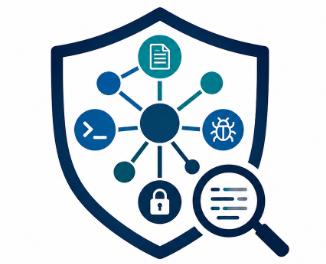
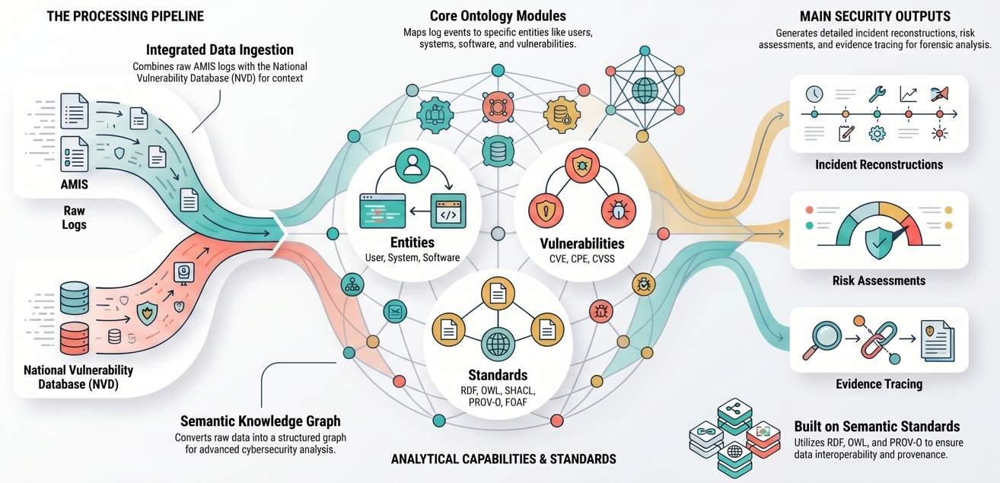

<p align="center">
  
</p>

# AMISecOnto: An Ontology for Cybersecurity Log and Vulnerability Analysis

## Table of Contents

- [Overview](#overview)
- [Ontology Scope](#ontology-scope)
- [Ontology Architecture](#ontology-architecture)
- [Repository Structure](#repository-structure)
- [Tools and Technologies](#tools-and-technologies)
- [Usage](#usage)
  - [Load Ontology](#load-ontology)
  - [Query the Knowledge Graph](#query-the-knowledge-graph)
  - [Validate Data with SHACL](#validate-data-with-shacl)
- [Competency Questions (CQs)](#competency-questions-cqs)
  - [Event Discovery and Filtering](#event-discovery-and-filtering)
  - [Event Lineage Tracing](#event-lineage-tracing)
  - [Authentication and Access Tracing](#authentication-and-access-tracing)
  - [Application, System, and Security Tracing](#application-system-and-security-tracing)
  - [Vulnerability Analysis and Exposure](#vulnerability-analysis-and-exposure)
  - [Risk Assessment and Incident Reconstruction (NIS2-aligned)](#risk-assessment-and-incident-reconstruction-nis2-aligned)   
- [SHACL Validation Shapes](#shacl-validation-shapes)
- [SPARQL Query Templates](#sparql-query-templates)
- [Examples](#examples)
- [Documentation](#documentation)
- [Contributing](#contributing)
- [License](#license)
  
## Overview

**AMISecOnto** is a modular cybersecurity ontology that transforms heterogeneous data—such as AMIS system logs and vulnerability intelligence (e.g., NVD)—into a unified semantic knowledge graph for advanced security analysis.

---

## Key Features

- **Integrated data ingestion**: Combines raw logs with vulnerability data for contextual enrichment  
- **Modular design**: Core modules for Entities, Vulnerabilities, and Standards  
- **Semantic enrichment**: Links events to CVE, CPE, and CVSS information  
- **Standards-based**: RDF, OWL, SHACL, PROV-O, FOAF  
- **Interoperability & provenance**: Ensures traceability and cross-system integration  
- **Analytics-ready**:
  - Event correlation  
  - Risk assessment  
  - Incident reconstruction  
  - Evidence tracing  

---

## Architecture and Processing Pipeline
AMISecOnto follows a structured pipeline:

1. **Data Ingestion**  
   Integrates AMIS logs with NVD vulnerability data  

2. **Semantic Knowledge Graph Construction**  
   Transforms raw data into a structured, queryable graph  

3. **Core Ontology Modules**  
   - **Entities**: Users, systems, software  
   - **Vulnerabilities**: CVE, CPE, CVSS  
   - **Standards**: RDF, OWL, SHACL, PROV-O, FOAF  

4. **Security Outputs**  
   - Incident reconstruction  
   - Risk assessment  
   - Evidence tracing  

---

## Ontology Modules

AMISecOnto is organized into interconnected modules:

- **Entity & Vulnerability Module**  
- **Log & Event Module**  
- **System & Activity Module**  
- **Security & Indicator Module**  

### Design Principles

- Separation of concerns  
- Reusability  
- Scalable knowledge graph construction  

<p align="center">
  
</p>

---

## Competency Questions (CQs)

The ontology is designed to answer the following competency questions:

### Event Discovery and Filtering
- **CQ1**: Which events occurred within a specific time range and satisfy selected filters?
- **CQ2**: Which events belong to a specific application, service, host, or component?
- **CQ3**: Which events belong to the same request or execution flow?
- **CQ4**: Which identifiers support grouping events into the same flow?

### Event Lineage Tracing
- **CQ5**: Which sequence of log events led to a specific error event?
- **CQ6**: Which events occurred before and after a given incident?
- **CQ7**: How security events correlate with system or application events?
- **CQ8**: Which entities or events represent the current analysis workflow?

### Authentication and Access Tracing
- **CQ9**: Which authentication attempts preceded access or privilege-escalation events?
- **CQ10**: Which information is required to reconstruct a user session timeline?
- **CQ11**: Which SSH events belong to the same session?
- **CQ12**: Which identifiers are consistently used for event correlation?

### Application, System, and Security Tracing
- **CQ13**: Which container lifecycle events are linked to application errors?
- **CQ14**: Which database events correlate with application requests?
- **CQ15**: Which system-level events preceded instability?
- **CQ16**: Which package installation or update events affect analysis?
- **CQ17**: Which evidence indicates that a package update caused an issue?
- **CQ18**: Which audit information is required for sensitive operations?
- **CQ19**: Which secret-management events correlate with authentication events?
- **CQ20**: Which factors complicate security trace reconstruction?

### Vulnerability Analysis and Exposure
- **CQ21**: Which installed or observed software components are affected by known vulnerabilities (CVEs)?
- **CQ22**: Which vulnerabilities are associated with specific packages, versions, or system components?
- **CQ23**: Which log events indicate the presence or activation of vulnerable components?

### Risk Assessment and Incident Reconstruction (NIS2-aligned)
- **CQ24**: Which combinations of log events and vulnerabilities indicate high-risk situations or potential compromise?
- **CQ25**: How can risk exposure be derived from log evidence, vulnerability severity (e.g., CVSS), and observed behavior?

---

## Repository Structure

- **data/**: Demo RDF data, statistics, and logs  
- **queries/**: SPARQL competency questions for evaluation  
- **scripts/**: Data ingestion, querying, validation, and CVE fetching  
- **AMISecOnto-v27.ttl**: Core ontology  

```bash
amiseconto/
├── data/
│   ├── amiseconto_demo_data.nt
│   ├── amiseconto_demo_stats.json
│   └── log_20k_AMISecOnto/
│
├── queries/
│   └── competency_questions/
│       ├── cq01_time_range_filtering.rq
│       ├── cq05_event_lineage_before_after_error.rq
│       ├── cq09_auth_before_privilege_escalation.rq
│       ├── cq16_package_updates_and_related_vulnerabilities.rq
│       ├── cq18_sensitive_operations.rq
│       ├── cq21_cross_source_correlation.rq
│       ├── cq22_multi_source_attack_patterns.rq
│       ├── cq23_multi_source_attack_patterns.rq
│       ├── cq24_incident_reconstruction.rq
│       └── linux_nvd_vulnerabilities_overview.rq
│
├── scripts/
│   ├── build_amiseconto_demo_graph.py
│   ├── fetch_nvd_linux_cves.py
│   ├── load_to_virtuoso.py
│   ├── query_virtuoso.py
│   └── validate_shacl_with_pyshacl.py
│
├── AMISecOnto-v27.ttl
├── README.md
```


---

## Tools and Technologies
- **Protégé** for ontology development
- **OWL / RDF / Turtle**
- **SPARQL** for querying
- Reused vocabularies:
  - PROV-O
  - FOAF

---

## Prerequisites

- **Python 3** (stdlib only for the main scripts)  
  - Optional: `pip install pyshacl` for SHACL validation
- **Virtuoso Open Source** running at:
  - `http://localhost:8890`
  - Endpoints:
    - `/sparql`
    - `/sparql-graph-crud`
- **Log dataset**:
  - Directory: `log_20k_AMISecOnto` under the project root  
  - Or specify a custom path using `--dataset-dir`

---

## Load Data (Full Pipeline)

Run all commands from the repository root:

### 1. Fetch NVD CVEs for Linux

```bash
python3 scripts/fetch_nvd_linux_cves.py --api-key "$NVD_API_KEY" --max-records 1000
```

### 2. Build Instance RDF

```bash
python3 scripts/build_amiseconto_demo_graph.py
```

Outputs:
```bash
build/amiseconto_demo_data.nt
build/amiseconto_demo_stats.json
```
### 3. Load into Virtuoso
```bash
python3 scripts/load_to_virtuoso.py
```

Loads:
AMISecOnto-v27.ttl
```bash
build/amiseconto_demo_data.nt
```

Default graph:
```bash
http://localhost:8890/AMISecOnto-v27
```

To append instead of replacing:
```bash
python3 scripts/load_to_virtuoso.py --keep-existing
```

### 4. Run (Use) the Demo

Execute competency queries:
```bash
python3 scripts/query_virtuoso.py queries/competency_questions/cq24_incident_reconstruction.rq
```
Replace the .rq file with any query under:
```bash
queries/competency_questions/
```

---

## Competency Questions – SHACL shapes and SPARQL queries

This document provides SHACL validation shapes and SPARQL query templates aligned with the defined competency questions (CQs) for the AMISecOnto ontology.

---

### SHACL shapes

SHACL Shapes in AMISecOnto are used to validate the structure and quality of data in the knowledge graph. They enforce constraints on entities like events, vulnerabilities, and assets, ensuring consistency and reliability for querying and analysis.

```turtle
@prefix sh: <http://www.w3.org/ns/shacl#> .
@prefix xsd: <http://www.w3.org/2001/XMLSchema#> .
@prefix rdf: <http://www.w3.org/1999/02/22-rdf-syntax-ns#> .
@prefix rdfs: <http://www.w3.org/2000/01/rdf-schema#> .
@prefix owl: <http://www.w3.org/2002/07/owl#> .
@prefix amis: <http://www.semanticweb.org/AMISecOnto#> .
@prefix amo: <http://www.semanticweb.org/AMISecOnto/> .
```
## Competency questions-aligned shacl validation framework for amiseconto demo data (build_amiseconto_demo_graph.py).
Predicate split: most event fields use amis: (#); hasIndicator, hasBaseScore, hasCVSS*, hasStatusCode use amo: (/).
```turtle
<http://www.semanticweb.org/AMISecOnto/shapes/cq>
    a owl:Ontology ;
    rdfs:label "AMISecOnto competency-question SHACL"@en ;
    rdfs:comment "Validates patterns needed by queries under queries/competency_questions/. Severity: Violation = data bug; Warning = recommended for correlation/CQ coverage."@en .
```

### Logevent core shape constraints (CQ1, CQ2)
```turtle

<http://www.semanticweb.org/AMISecOnto/shapes#LogEventCoreShape>
    a sh:NodeShape ;
    sh:targetClass amis:LogEvent ;
    sh:property [
        sh:path amis:belongsToLog ;
        sh:minCount 1 ;
        sh:message "Each LogEvent must belong to a Log (belongsToLog) for graph navigation."@en
    ] ;
    sh:property [
        sh:path amis:hasRawMessage ;
        sh:datatype xsd:string ;
        sh:minCount 1 ;
        sh:message "Each LogEvent must keep the original raw log text."@en
    ] ;
    sh:property [
        sh:path amis:hasLogFileName ;
        sh:datatype xsd:string ;
        sh:minCount 1 ;
        sh:message "Each LogEvent must record source log filename."@en
    ] ;
    sh:property [
        sh:path amis:hasLineNumber ;
        sh:datatype xsd:integer ;
        sh:minCount 1 ;
        sh:message "Each LogEvent should record line number within the log file."@en
    ] ;
    sh:property [
        sh:path amis:hasTimestamp ;
        sh:datatype xsd:string ;
        sh:maxCount 1 ;
        sh:severity sh:Warning ;
        sh:message "LogEvent should have one timestamp (xsd:string; ISO-8601 lexical form recommended for xsd:dateTime() in SPARQL)."@en
    ] ;
    sh:property [
        sh:path amis:hasHostname ;
        sh:datatype xsd:string ;
        sh:maxCount 1 ;
        sh:severity sh:Warning ;
        sh:message "LogEvent should include hostname for cross-source correlation."@en
    ] .
```

### Constraints for ensuring bidirectional consistency in logevent lineage (CQ5, CQ6)
```turtle
<http://www.semanticweb.org/AMISecOnto/shapes#EventLineageShape>
    a sh:NodeShape ;
    sh:targetClass amis:LogEvent ;
    sh:sparql [
        a sh:SPARQLConstraint ;
        sh:message "If a LogEvent has a previous event, that previous event should link back with hasNextLogEvent."@en ;
        sh:select """
            SELECT $this
            WHERE {
              $this amis:hasPreviousLogEvent ?prev .
              FILTER NOT EXISTS { ?prev amis:hasNextLogEvent $this . }
            }
        """
    ] ;
    sh:sparql [
        a sh:SPARQLConstraint ;
        sh:severity sh:Warning ;
        sh:message "If a LogEvent has a next event, that next event should link back with hasPreviousLogEvent."@en ;
        sh:select """
            SELECT $this
            WHERE {
              $this amis:hasNextLogEvent ?next .
              FILTER NOT EXISTS { ?next amis:hasPreviousLogEvent $this . }
            }
        """
    ] .
```

### Constraints for session reconstruction and user attribution in authentication events (CQ9, CQ10, CQ11, CQ12)
```turtle
<http://www.semanticweb.org/AMISecOnto/shapes#AuthenticationEventShape>
    a sh:NodeShape ;
    sh:targetClass amis:AuthenticationLogEvent ;
    sh:property [
        sh:path amis:hasSessionID ;
        sh:datatype xsd:string ;
        sh:minCount 1 ;
        sh:message "AuthenticationLogEvent should record hasSessionID (demo maps syslog PID) for session reconstruction."@en
    ] ;
    sh:sparql [
        a sh:SPARQLConstraint ;
        sh:severity sh:Warning ;
        sh:message "When identity is present, prefer both hasUser and hasUserName for attribution queries."@en ;
        sh:select """
            SELECT $this
            WHERE {
              $this amis:hasUser ?u .
              FILTER NOT EXISTS { $this amis:hasUserName ?n . }
            }
        """
    ] ;
    sh:sparql [
        a sh:SPARQLConstraint ;
        sh:severity sh:Info ;
        sh:message "Authentication events without hasUser or hasUserName limit user-centric CQs."@en ;
        sh:select """
            SELECT $this
            WHERE {
              $this a amis:AuthenticationLogEvent .
              FILTER NOT EXISTS { $this amis:hasUser ?u . }
              FILTER NOT EXISTS { $this amis:hasUserName ?n . }
            }
        """
    ] .
```

### Audit, sudo, and su event constraints for indicator linking and user attribution (CQ18, CQ19, CQ20)
```turtle
<http://www.semanticweb.org/AMISecOnto/shapes#SecurityEventShape>
    a sh:NodeShape ;
    sh:targetClass amis:SecurityLogEvent ;
    sh:property [
        sh:path amo:hasIndicator ;
        sh:class amis:Indicator ;
        sh:severity sh:Warning ;
        sh:message "When present, hasIndicator must point to an Indicator individual (use amo: /hasIndicator in RDF)."@en
    ] ;
    sh:sparql [
        a sh:SPARQLConstraint ;
        sh:severity sh:Warning ;
        sh:message "Sensitive security messages (sudo/su/auth failure) should include user attribution when the log line supports it."@en ;
        sh:select """
            SELECT $this
            WHERE {
              $this amis:hasRawMessage ?m .
              FILTER (
                CONTAINS(LCASE(STR(?m)), "sudo") ||
                CONTAINS(LCASE(STR(?m)), "su:") ||
                CONTAINS(LCASE(STR(?m)), "authentication failure")
              )
              FILTER NOT EXISTS { $this amis:hasUserName ?u1 . }
              FILTER NOT EXISTS { $this amis:hasUser ?u2 . }
            }
        """
    ] .
```

### Validation of package event semantics and system package associations (CQ16, CQ17)
```turtle
<http://www.semanticweb.org/AMISecOnto/shapes#PackageEventShape>
    a sh:NodeShape ;
    sh:targetClass amis:InstalledPackageLogEvent ;
    sh:property [
        sh:path amis:hasPackageName ;
        sh:datatype xsd:string ;
        sh:minCount 1 ;
        sh:message "InstalledPackageLogEvent must have package name."@en
    ] ;
    sh:property [
        sh:path amis:hasPackageAction ;
        sh:datatype xsd:string ;
        sh:minCount 1 ;
        sh:severity sh:Warning ;
        sh:message "InstalledPackageLogEvent should record package action (install/upgrade/configure/etc.)."@en
    ] ;
    sh:property [
        sh:path amis:hasPackage ;
        sh:class amis:SystemPackage ;
        sh:minCount 1 ;
        sh:message "InstalledPackageLogEvent must link to a SystemPackage via hasPackage."@en
    ] .
```

### Constraints for http access log correlation and request association (CQ14)
```turtle
<http://www.semanticweb.org/AMISecOnto/shapes#AccessLogCorrelationShape>
    a sh:NodeShape ;
    sh:targetClass amis:AccessLogEvent ;
    sh:property [
        sh:path amis:hasRequestURI ;
        sh:datatype xsd:string ;
        sh:minCount 1 ;
        sh:severity sh:Warning ;
        sh:message "AccessLogEvent should include hasRequestURI for URI-centric correlation."@en
    ] ;
    sh:property [
        sh:path amis:belongsToRequest ;
        sh:class amis:Request ;
        sh:minCount 1 ;
        sh:severity sh:Warning ;
        sh:message "AccessLogEvent should link belongsToRequest for request grouping."@en
    ] .
```

### Validation of vulnerability entities with nvd-derived severity and cvss metadata (CQ16, CQ17, CQ21, CQ22 (CVE-centric joins), CQ23)
```turtle
<http://www.semanticweb.org/AMISecOnto/shapes#VulnerabilityShape>
    a sh:NodeShape ;
    sh:targetClass amis:Vulnerability ;
    sh:property [
        sh:path rdfs:label ;
        sh:datatype xsd:string ;
        sh:minCount 1 ;
        sh:message "Each Vulnerability should carry CVE id in rdfs:label."@en
    ] ;
    sh:property [
        sh:path amis:hasSeverityCode ;
        sh:datatype xsd:string ;
        sh:minCount 1 ;
        sh:severity sh:Warning ;
        sh:message "Vulnerability should have hasSeverityCode (e.g. NVD baseSeverity or derived band)."@en
    ] ;
    sh:property [
        sh:path amo:hasBaseScore ;
        sh:datatype xsd:decimal ;
        sh:maxCount 1 ;
        sh:severity sh:Warning ;
        sh:message "Vulnerability should expose amo:hasBaseScore when CVSS base score is known."@en
    ] ;
    sh:property [
        sh:path amis:hasMessage ;
        sh:datatype xsd:string ;
        sh:minCount 1 ;
        sh:severity sh:Warning ;
        sh:message "Vulnerability should include hasMessage (description text) for reporting."@en
    ] ;
    sh:property [
        sh:path amis:affectsSystem ;
        sh:nodeKind sh:IRI ;
        sh:severity sh:Warning ;
        sh:minCount 1 ;
        sh:message "Demo graph links vulnerabilities to at least one System via affectsSystem when ingested."@en
    ] .
```

### Validation of indicator entities for consistent identification and labeling (CQ23, CQ24)
```turtle


<http://www.semanticweb.org/AMISecOnto/shapes#IndicatorShape>
    a sh:NodeShape ;
    sh:targetClass amis:Indicator ;
    sh:property [
        sh:path rdfs:label ;
        sh:datatype xsd:string ;
        sh:minCount 1 ;
        sh:message "Each Indicator should have rdfs:label (matches pattern name in the builder)."@en
    ] .

```


## SPARQL Queries
SPARQL queries in AMISSecOnto are designed to retrieve relevant cybersecurity information from the knowledge graph, supporting tasks such as event discovery, filtering, and analysis. This approach ensures that the ontology effectively addresses practical requirements, enabling the extraction of insights related to vulnerabilities, threats, assets, and security events in real-world scenarios.

## Event Discovery and Filtering
### CQ1 – Which events occurred within a specific time range and satisfy selected filters?
```sparql
PREFIX amis: <http://www.semanticweb.org/AMISecOnto#>
PREFIX xsd: <http://www.w3.org/2001/XMLSchema#>

SELECT ?event ?timestamp ?host ?eventType ?message
WHERE {
  GRAPH <http://localhost:8890/AMISecOnto-v27> {
    ?event a amis:LogEvent ;
           amis:hasTimestamp ?timestamp ;
           amis:hasRawMessage ?message .
    OPTIONAL { ?event amis:hasHostname ?host . }
    OPTIONAL { ?event amis:hasEventType ?eventType . }

    FILTER (
      ?timestamp >= "2025-02-21T10:00:00Z"^^xsd:dateTime &&
      ?timestamp <= "2025-02-21T10:10:00Z"^^xsd:dateTime
    )
  }
}
ORDER BY ?timestamp
LIMIT 200
```
This query returns a time-ordered list of log events with key information extracted for each event.

### Event Lineage Tracing
## CQ5 - Which sequence of log events led to a specific error event?
```sparql
PREFIX amis: <http://www.semanticweb.org/AMISecOnto#>

SELECT ?event ?prev ?next ?timestamp ?message
WHERE {
  GRAPH <http://localhost:8890/AMISecOnto-v27> {
    ?event a amis:LogEvent ;
           amis:hasRawMessage ?message .
    OPTIONAL { ?event amis:hasTimestamp ?timestamp . }
    OPTIONAL { ?event amis:hasPreviousLogEvent ?prev . }
    OPTIONAL { ?event amis:hasNextLogEvent ?next . }

    FILTER (
      CONTAINS(LCASE(?message), "error") ||
      CONTAINS(LCASE(?message), "exception") ||
      CONTAINS(LCASE(?message), "failed")
    )
  }
}
ORDER BY ?timestamp
LIMIT 100
```

This query identifies error-related log events and reconstructs their temporal context by retrieving preceding and succeeding events, along with timestamps and raw messages, enabling the analysis of event sequences leading to failures.

### Authentication and Access Tracing
## CQ9 - Which authentication attempts preceded access or privilege-escalation events?
```sparql
PREFIX amis: <http://www.semanticweb.org/AMISecOnto#>
PREFIX amo: <http://www.semanticweb.org/AMISecOnto/>

SELECT ?user ?sudoEvent ?sudoTime ?command
WHERE {
  {
    SELECT ?sudoEvent ?sudoTime ?user ?command
    WHERE {
      GRAPH <http://localhost:8890/AMISecOnto-v27> {
        ?sudoEvent a amis:SudoLogEvent ;
          amis:hasTimestamp ?sudoTime ;
          amis:hasUser ?user ;
          amis:hasRawMessage ?sudoMessage .
        OPTIONAL { ?sudoEvent amis:hasCommand ?cmdDirect . }
        OPTIONAL {
          ?h1 amo:hasNextLogEvent ?sudoEvent .
          ?h1 amis:hasCommand ?cmdHop1 .
        }
        OPTIONAL {
          ?h2 amo:hasNextLogEvent ?h1b .
          ?h1b amo:hasNextLogEvent ?sudoEvent .
          ?h2 amis:hasCommand ?cmdHop2 .
        }
        OPTIONAL {
          ?h3 amo:hasNextLogEvent ?h2b .
          ?h2b amo:hasNextLogEvent ?h1c .
          ?h1c amo:hasNextLogEvent ?sudoEvent .
          ?h3 amis:hasCommand ?cmdHop3 .
        }
        OPTIONAL {
          ?h4 amo:hasNextLogEvent ?h3b .
          ?h3b amo:hasNextLogEvent ?h2c .
          ?h2c amo:hasNextLogEvent ?h1d .
          ?h1d amo:hasNextLogEvent ?sudoEvent .
          ?h4 amis:hasCommand ?cmdHop4 .
        }
        OPTIONAL {
          ?h5 amo:hasNextLogEvent ?h4b .
          ?h4b amo:hasNextLogEvent ?h3c .
          ?h3c amo:hasNextLogEvent ?h2d .
          ?h2d amo:hasNextLogEvent ?h1e .
          ?h1e amo:hasNextLogEvent ?sudoEvent .
          ?h5 amis:hasCommand ?cmdHop5 .
        }
        OPTIONAL { ?sudoEvent amis:hasMessage ?sudoMsgShort . }
        FILTER (
          CONTAINS(LCASE(STR(?sudoMessage)), "session opened") ||
          CONTAINS(LCASE(STR(?sudoMessage)), "suspicious") ||
          CONTAINS(LCASE(STR(?sudoMessage)), "sudoers")
        )
        BIND(
          COALESCE(
            ?cmdDirect,
            ?cmdHop1,
            ?cmdHop2,
            ?cmdHop3,
            ?cmdHop4,
            ?cmdHop5,
            IF(
              CONTAINS(STR(?sudoMessage), "COMMAND="),
              REPLACE(STR(?sudoMessage), "^.*COMMAND=", ""),
              COALESCE(?sudoMsgShort, STR(?sudoMessage))
            )
          ) AS ?command
        )
      }
    }
    ORDER BY DESC(?sudoTime)
    LIMIT 250
  }

  FILTER EXISTS {
    GRAPH <http://localhost:8890/AMISecOnto-v27> {
      ?authEvent a amis:AuthenticationLogEvent ;
        amis:hasTimestamp ?authTime ;
        amis:hasUser ?user ;
        amis:hasRawMessage ?authMessage .
      FILTER (?authTime <= ?sudoTime)
      FILTER (
        CONTAINS(LCASE(STR(?authMessage)), "accepted") ||
        CONTAINS(LCASE(STR(?authMessage)), "session opened") ||
        CONTAINS(LCASE(STR(?authMessage)), "authentication")
      )
    }
  }
}
ORDER BY ?sudoTime
LIMIT 100
```
This query correlates authentication events with subsequent access or privilege-escalation activities by identifying prior successful or relevant authentication attempts and linking them to sudo-related log events, reconstructing the command execution context across sequential log entries.


### 
## CQ16 - Which package installation or update events affect analysis?
```sparql
PREFIX amis: <http://www.semanticweb.org/AMISecOnto#>

SELECT ?packageEvent ?timestamp ?packageName ?version ?vulnLabel
WHERE {
  {
    SELECT ?packageEvent ?timestamp ?packageName ?version ?vulnLabel
    WHERE {
      GRAPH <http://localhost:8890/AMISecOnto-v27> {
        ?packageEvent a amis:InstalledPackageLogEvent ;
          amis:hasTimestamp ?timestamp ;
          amis:hasPackageName ?packageName ;
          amis:hasPackage ?package .
        OPTIONAL { ?packageEvent amis:hasPackageVersion ?version . }

        OPTIONAL { ?packageEvent amis:relatedToVulnerability ?v1 . }
        OPTIONAL { ?packageEvent amis:evidenceByLogEvent ?v2 . }
        OPTIONAL {
          ?component a amis:Dependency ;
            amis:hasPackageName ?packageName ;
            amis:relatedToVulnerability ?v3 .
        }
        BIND(COALESCE(?v1, ?v2, ?v3) AS ?vuln)
        BIND(IF(BOUND(?vuln), REPLACE(STR(?vuln), "^.*/", ""), "") AS ?vulnLabel)
      }
    }
  }
}
ORDER BY DESC(STRLEN(?vulnLabel)) DESC(?timestamp)
LIMIT 100
```

This query identifies package installation or update events relevant to security analysis by linking them to associated vulnerabilities (e.g., CVEs) through multiple relationship paths, enabling the detection of potentially affected components and their versions.

### Application, System, and Security Tracing
## CQ18 - Which audit information is required for sensitive operations?
```sparql
PREFIX amis: <http://www.semanticweb.org/AMISecOnto#>
PREFIX amo: <http://www.semanticweb.org/AMISecOnto/>
PREFIX rdfs: <http://www.w3.org/2000/01/rdf-schema#>

# Demo RDF links indicators with amo:hasIndicator (<.../AMISecOnto/hasIndicator>), not amis:hasIndicator (#…).
# Optional # form covers reasoning stores that align OWL to instance predicates.
# BIND yields a string for ?indicatorLabel (empty when no indicator) so UIs always show the column.
SELECT ?event ?timestamp ?host ?userName ?indicatorLabel ?message
WHERE {
  GRAPH <http://localhost:8890/AMISecOnto-v27> {
    ?event a amis:SecurityLogEvent ;
      amis:hasTimestamp ?timestamp ;
      amis:hasHostname ?host ;
      amis:hasRawMessage ?message .

    FILTER (
      CONTAINS(LCASE(STR(?message)), "sudo") ||
      CONTAINS(LCASE(STR(?message)), "su:") ||
      CONTAINS(LCASE(STR(?message)), "sensitive_read") ||
      CONTAINS(LCASE(STR(?message)), "backdoor") ||
      CONTAINS(LCASE(STR(?message)), "audit")
    )

    OPTIONAL { ?event amis:hasUserName ?userName . }
    OPTIONAL { ?event amo:hasIndicator ?i1 . }
    OPTIONAL { ?event amis:hasIndicator ?i2 . }
    BIND(COALESCE(?i1, ?i2) AS ?indicator)
    OPTIONAL { ?indicator rdfs:label ?il }
    BIND(
      IF(
        BOUND(?indicator),
        COALESCE(?il, REPLACE(STR(?indicator), "^.*/", "")),
        ""
      ) AS ?indicatorLabel
    )
  }
}
ORDER BY DESC(STRLEN(?indicatorLabel)) ?timestamp
LIMIT 200
```

### Vulnerability Analysis and Exposure
## CQ21 - Which installed or observed software components are affected by known vulnerabilities (CVEs)? 
```sparql
PREFIX amis: <http://www.semanticweb.org/AMISecOnto#>
PREFIX amo: <http://www.semanticweb.org/AMISecOnto/>

# CQ21 - Which installed or observed software components are affected by known vulnerabilities (CVEs)?
# Observed: manifest Dependency via relatedToVulnerability or exposes (slash IRI).
# Installed: InstalledPackageLogEvent linked to NVD by the demo build.
# Three plain UNION branches avoid OPTIONAL+COALESCE+FILTER, which some Virtuoso builds reject.
SELECT DISTINCT ?component ?componentKind ?packageName ?packageVersion ?cveId ?severity
WHERE {
  GRAPH <http://localhost:8890/AMISecOnto-v27> {
    {
      ?component a amis:Dependency ;
        amis:hasPackageName ?packageName ;
        amis:relatedToVulnerability ?vuln .
      BIND("dependency (manifest)" AS ?componentKind)
      OPTIONAL { ?component amis:hasPackageVersion ?packageVersion }
      ?vuln a amis:Vulnerability .
      BIND(REPLACE(STR(?vuln), "^.*/", "") AS ?cveId)
      OPTIONAL { ?vuln amis:hasSeverityCode ?severity }
    }
    UNION
    {
      ?component a amis:Dependency ;
        amis:hasPackageName ?packageName .
      ?component amo:exposes ?vuln .
      BIND("dependency (manifest)" AS ?componentKind)
      OPTIONAL { ?component amis:hasPackageVersion ?packageVersion }
      ?vuln a amis:Vulnerability .
      BIND(REPLACE(STR(?vuln), "^.*/", "") AS ?cveId)
      OPTIONAL { ?vuln amis:hasSeverityCode ?severity }
    }
    UNION
    {
      ?component a amis:InstalledPackageLogEvent ;
        amis:hasPackageName ?packageName ;
        amis:relatedToVulnerability ?vuln .
      BIND("installed (dpkg event)" AS ?componentKind)
      OPTIONAL { ?component amis:hasPackageVersion ?packageVersion }
      ?vuln a amis:Vulnerability .
      BIND(REPLACE(STR(?vuln), "^.*/", "") AS ?cveId)
      OPTIONAL { ?vuln amis:hasSeverityCode ?severity }
    }
  }
}
ORDER BY ?componentKind ?packageName ?cveId
LIMIT 500
```

### Risk Assessment and Incident Reconstruction (NIS2-aligned)
## CQ22 - Which vulnerabilities are associated with specific packages, versions, or system components? 
```sparql
PREFIX amis: <http://www.semanticweb.org/AMISecOnto#>
PREFIX amo: <http://www.semanticweb.org/AMISecOnto/>
PREFIX rdfs: <http://www.w3.org/2000/01/rdf-schema#>

# CQ22 - Which vulnerabilities are associated with specific packages, versions, or system components?
# Vulnerability-centric view: JAR dependencies, dpkg install events, and system-level (NVD-scoped) systems.
# Per-chunk LIMITs keep manifest, dpkg, and platform rows in one result set; raise LIMITs or drop FILTER for full data.
SELECT DISTINCT ?vulnerability ?cveId ?severity ?associationKind ?packageName ?packageVersion ?hostingSystemLabel ?componentUri
WHERE {
  {
    SELECT ?vulnerability ?cveId ?severity ?associationKind ?packageName ?packageVersion ?hostingSystemLabel ?componentUri ?sortKey
    WHERE {
      GRAPH <http://localhost:8890/AMISecOnto-v27> {
        {
          ?componentUri a amis:Dependency ;
            amis:hasPackageName ?packageName ;
            amis:relatedToVulnerability ?vulnerability .
          BIND("manifest dependency (JAR)" AS ?associationKind)
          BIND(1 AS ?sortKey)
          OPTIONAL { ?componentUri amis:hasPackageVersion ?packageVersion }
          OPTIONAL {
            ?stack a amis:System ;
                   amis:containsPackage ?componentUri ;
                   rdfs:label ?hostingSystemLabel .
          }
          ?vulnerability a amis:Vulnerability .
          BIND(REPLACE(STR(?vulnerability), "^.*/", "") AS ?cveId)
          OPTIONAL { ?vulnerability amis:hasSeverityCode ?severity }
        }
        UNION
        {
          ?componentUri a amis:Dependency ;
            amis:hasPackageName ?packageName .
          ?componentUri amo:exposes ?vulnerability .
          BIND("manifest dependency (JAR)" AS ?associationKind)
          BIND(1 AS ?sortKey)
          OPTIONAL { ?componentUri amis:hasPackageVersion ?packageVersion }
          OPTIONAL {
            ?stack a amis:System ;
                   amis:containsPackage ?componentUri ;
                   rdfs:label ?hostingSystemLabel .
          }
          ?vulnerability a amis:Vulnerability .
          BIND(REPLACE(STR(?vulnerability), "^.*/", "") AS ?cveId)
          OPTIONAL { ?vulnerability amis:hasSeverityCode ?severity }
        }
      }
    }
    LIMIT 50
  }
  UNION
  {
    SELECT ?vulnerability ?cveId ?severity ?associationKind ?packageName ?packageVersion ?hostingSystemLabel ?componentUri ?sortKey
    WHERE {
      GRAPH <http://localhost:8890/AMISecOnto-v27> {
        ?componentUri a amis:InstalledPackageLogEvent ;
          amis:hasPackageName ?packageName ;
          amis:relatedToVulnerability ?vulnerability .
        BIND("installed package (dpkg log)" AS ?associationKind)
        BIND(2 AS ?sortKey)
        OPTIONAL { ?componentUri amis:hasPackageVersion ?packageVersion }
        ?vulnerability a amis:Vulnerability .
        BIND(REPLACE(STR(?vulnerability), "^.*/", "") AS ?cveId)
        OPTIONAL { ?vulnerability amis:hasSeverityCode ?severity }
        OPTIONAL { ?componentUri amis:hasHostname ?hostingSystemLabel }
      }
    }
    LIMIT 400
  }
  UNION
  {
    SELECT ?vulnerability ?cveId ?severity ?associationKind ?packageName ?packageVersion ?hostingSystemLabel ?componentUri ?sortKey
    WHERE {
      GRAPH <http://localhost:8890/AMISecOnto-v27> {
        ?componentUri a amis:System ;
          rdfs:label ?hostingSystemLabel ;
          amis:hasVulnerability ?vulnerability .
        BIND("platform / infrastructure (system-level)" AS ?associationKind)
        BIND(3 AS ?sortKey)
        BIND("" AS ?packageName)
        BIND("" AS ?packageVersion)
        ?vulnerability a amis:Vulnerability .
        BIND(REPLACE(STR(?vulnerability), "^.*/", "") AS ?cveId)
        OPTIONAL { ?vulnerability amis:hasSeverityCode ?severity }
        FILTER(CONTAINS(LCASE(?hostingSystemLabel), "linux"))
      }
    }
    LIMIT 200
  }
}
ORDER BY ?sortKey ?packageName ?cveId
```
This query provides a vulnerability-centric view of affected components by associating CVEs with manifest dependencies, installed packages, and system-level infrastructure, including package names, versions, severity labels, hosting systems, and component URIs.

## CQ23 - Which log events indicate the presence or activation of vulnerable components?
```sparql
PREFIX amis: <http://www.semanticweb.org/AMISecOnto#>
PREFIX amo: <http://www.semanticweb.org/AMISecOnto/>
PREFIX xsd: <http://www.w3.org/2001/XMLSchema#>

# CQ23 - Which log events indicate the presence or activation of vulnerable components?
# Presence: dpkg events with relatedToVulnerability.
# Activation: events linked to the vulnerability-probe indicator resource (demo NT uses this fixed IRI).
# Virtuoso SP031: avoid rdfs:label + FILTER on a variable inside nested SELECT/UNION; use grounded indicator IRI.
# Inner LIMITs keep dpkg rows and probe rows in one result set.
# Severity: amis:hasSeverityCode stores the NVD/API qualitative label (baseSeverity, e.g. MEDIUM). When UNKNOWN or missing, derive from amo:hasBaseScore (same bands as the build script). Rebuild/reload NT after fetch so labels match API objects.
# Regenerate NT after adding hasBaseScore. Probe rows have no CVE link: show n/a for severity.
SELECT DISTINCT ?logEvent ?evidenceKind ?timestamp ?host ?packageName ?packageVersion ?cveId ?severity
WHERE {
  {
    SELECT ?logEvent ?evidenceKind ?timestamp ?host ?packageName ?packageVersion ?cveId ?severity
    WHERE {
      GRAPH <http://localhost:8890/AMISecOnto-v27> {
        ?logEvent a amis:InstalledPackageLogEvent ;
          amis:hasPackageName ?packageName ;
          amis:relatedToVulnerability ?vuln .
        BIND("installed package linked to CVE (presence)" AS ?evidenceKind)
        OPTIONAL { ?logEvent amis:hasTimestamp ?timestamp . }
        OPTIONAL { ?logEvent amis:hasHostname ?host . }
        OPTIONAL { ?logEvent amis:hasPackageVersion ?packageVersion . }
        ?vuln a amis:Vulnerability .
        BIND(REPLACE(STR(?vuln), "^.*/", "") AS ?cveId)
        OPTIONAL { ?vuln amis:hasSeverityCode ?sevRaw . }
        OPTIONAL { ?vuln amo:hasBaseScore ?cvss . }
        BIND(
          IF(
            BOUND(?sevRaw) && LCASE(STR(?sevRaw)) != "unknown",
            STR(?sevRaw),
            IF(
              BOUND(?cvss),
              IF(
                xsd:decimal(?cvss) >= 9.0,
                "CRITICAL",
                IF(
                  xsd:decimal(?cvss) >= 7.0,
                  "HIGH",
                  IF(
                    xsd:decimal(?cvss) >= 4.0,
                    "MEDIUM",
                    IF(xsd:decimal(?cvss) > 0.0, "LOW", "UNKNOWN")
                  )
                )
              ),
              IF(BOUND(?sevRaw), STR(?sevRaw), "UNKNOWN")
            )
          ) AS ?severity
        )
      }
    }
    LIMIT 250
  }
  UNION
  {
    SELECT ?logEvent ?evidenceKind ?timestamp ?host ?packageName ?packageVersion ?cveId ?severity
    WHERE {
      GRAPH <http://localhost:8890/AMISecOnto-v27> {
        {
          ?logEvent amis:belongsToLog ?log .
          ?logEvent amo:hasIndicator <http://www.semanticweb.org/AMISecOnto/indicator/b31be47a71ebb8a6> .
          BIND("vulnerability-probe (activation pattern)" AS ?evidenceKind)
          OPTIONAL { ?logEvent amis:hasTimestamp ?timestamp . }
          OPTIONAL { ?logEvent amis:hasHostname ?host . }
          BIND("" AS ?packageName)
          BIND("" AS ?packageVersion)
          BIND("" AS ?cveId)
          BIND("n/a (indicator-only row)" AS ?severity)
        }
        UNION
        {
          ?logEvent amis:belongsToLog ?log .
          ?logEvent amis:hasIndicator <http://www.semanticweb.org/AMISecOnto/indicator/b31be47a71ebb8a6> .
          BIND("vulnerability-probe (activation pattern)" AS ?evidenceKind)
          OPTIONAL { ?logEvent amis:hasTimestamp ?timestamp . }
          OPTIONAL { ?logEvent amis:hasHostname ?host . }
          BIND("" AS ?packageName)
          BIND("" AS ?packageVersion)
          BIND("" AS ?cveId)
          BIND("n/a (indicator-only row)" AS ?severity)
        }
      }
    }
    LIMIT 250
  }
}
ORDER BY ?evidenceKind DESC(?timestamp) ?logEvent
```
This query detects log evidence of vulnerable components by combining package-level CVE presence indicators with vulnerability-probe activation patterns, enriching each event with package details, timestamps, host information, CVE identifiers, and derived severity levels


## CQ24 - Which combinations of log events and vulnerabilities indicate high-risk situations or potential compromise?
```sparql
PREFIX amis: <http://www.semanticweb.org/AMISecOnto#>
PREFIX amo: <http://www.semanticweb.org/AMISecOnto/>
PREFIX rdfs: <http://www.w3.org/2000/01/rdf-schema#>

# Instance NT uses slash IRI http://.../AMISecOnto/hasIndicator (amo:), not amis:#hasIndicator.
SELECT ?event ?timestamp ?host ?userName ?indicatorLabel ?message ?vulnLabel
WHERE {
  GRAPH <http://localhost:8890/AMISecOnto-v27> {
    ?event a amis:LogEvent ;
           amis:hasTimestamp ?timestamp ;
           amis:hasHostname ?host ;
           amis:hasRawMessage ?message .
    OPTIONAL { ?event amis:hasUserName ?userName . }
    OPTIONAL {
      ?event amo:hasIndicator ?indicator .
      ?indicator rdfs:label ?indicatorLabel .
    }
    OPTIONAL {
      ?event amis:evidenceByLogEvent ?vuln .
      ?vuln rdfs:label ?vulnLabel .
    }

    FILTER (
      BOUND(?indicatorLabel) ||
      CONTAINS(LCASE(?message), "exploit") ||
      CONTAINS(LCASE(?message), "suspicious") ||
      CONTAINS(LCASE(?message), "authentication failure") ||
      CONTAINS(LCASE(?message), "path traversal")
    )
  }
}
ORDER BY ?timestamp
LIMIT 300
```
This query retrieves potentially suspicious log events by combining semantic indicators and keyword-based detection, linking events to known indicators and associated vulnerabilities while providing contextual information such as timestamps, hosts, users, and raw messages for security analysis.


